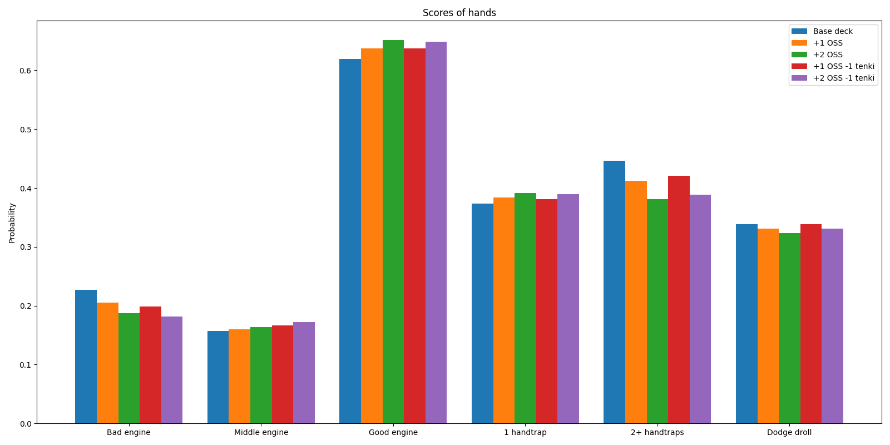

# Yu-Gi-Oh deck building helper -- Hand analysis

This is a simple tool to help you build your Yu-Gi-Oh deck. It will evaluate multiple
starting hands and tell you the probability to open a bad or a good hand depending on
the cards you put in your deck.


## Installation

In a fresh virtual environment, run:

```bash
pip install -e .
```

## Demo (fire king deck example)

Look at the `configs/base.yaml` file. It contains the list of cards in the fire king
base deck. You can add or remove cards from this list and test multiple configs in a
configuration file like `configs/fireking/example.txt`.

The list of cards with their names are available in the `cards` folder.

You can run the following command (`n` is the number of hands to evaluate, default is 100 000,
`c` is the number of cards in hand, default is 5)

```bash
python evaluate/main.py --name=fireking --configs=configs/fireking/example.txt -n=10000 -c=5
```

It will output probabilities for each labels and plot will be
shown and saved in `plots/fireking`. The plot looks like:



## Add your own deck

Here are the steps to add your own deck analysis:

### Update the card database

Add generics cards (staples, non-archetype cards) in `cards/generics.yaml`. You can add
the attributes you want (ex "atk", "is_normal", ...) but do not forget to add these
attributes to pre-existing cards if you use them.

Do the same with archetype cards in `cards/<archetype_name>.yaml`.

### Create a base deck

Add an entry in `configs/base.yaml` with the list of cards under the name `<archetype_name>`. You can use `- x <card_name>` to add multiple copies of a card
(x = 1, 2, 3).

### Create a configuration file

You can create your configs to modify the base deck. See the example in
`configs/fireking/example.txt`. All the cards you add should be in the card database
either in `cards/generics.yaml` or in `cards/<archetype_name>.yaml`.

The rules of configuration files are:

* Start a new config with the line `## <config name>`
* You can add additional comments with `#` (but not after `##`)
* You can add cards with the line `+ <card name>`
* You can remove cards with the line `- <card name>`

You can put this file in `configs/<archetype_name>/<config_name>.txt`.

### Create the evaluation function

This is the longest part. You need to create a python function `score_hand.py`
in `evaluate/<archetype_name>/score.py` that takes two lists of cards (hand and remaining
deck) and returns a list of score under str format (ex ["brick"], ["average"],
["good start", "no handtraps"], ...).
You can use the labels you want but you must set a constant `ORDER` in the same file
containing the list of possible labels in the order to be used in the plots.

You can find an example in `evaluate/fireking/score.py`.

### Run the evaluation

Run the following command:

```bash
python evaluate/main.py --name=<archetype_name> --configs=<config_paths> -n=<number_of_hands>
```

It shows you the plots, and it is also saved in `results/<archetype_name>`.
